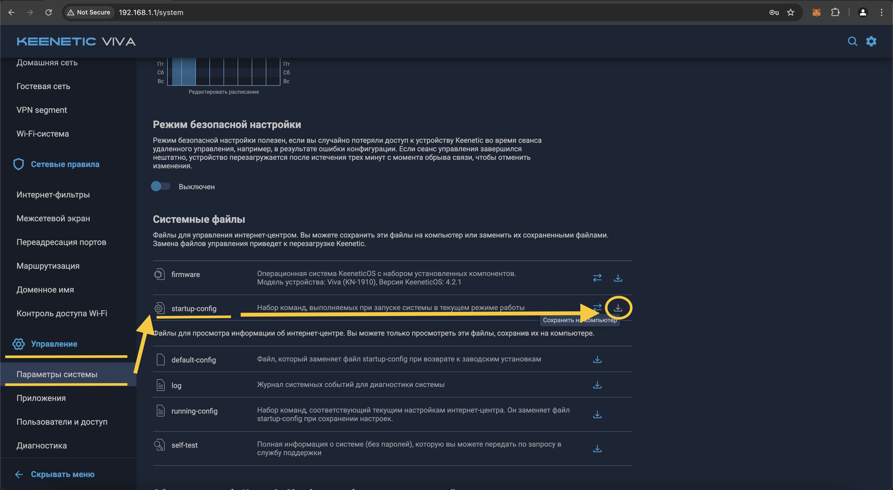
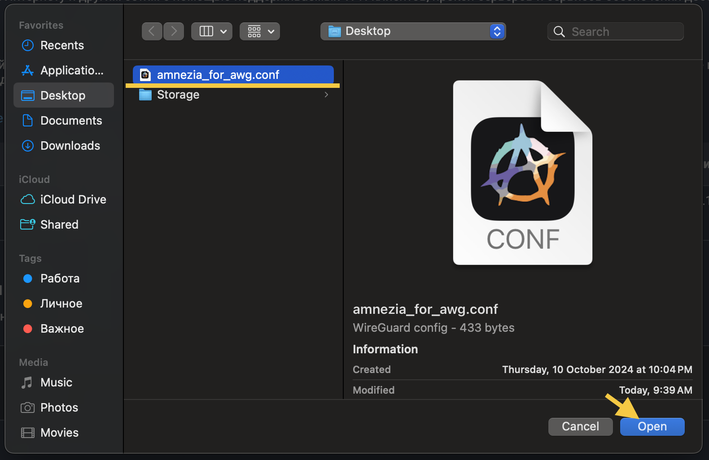
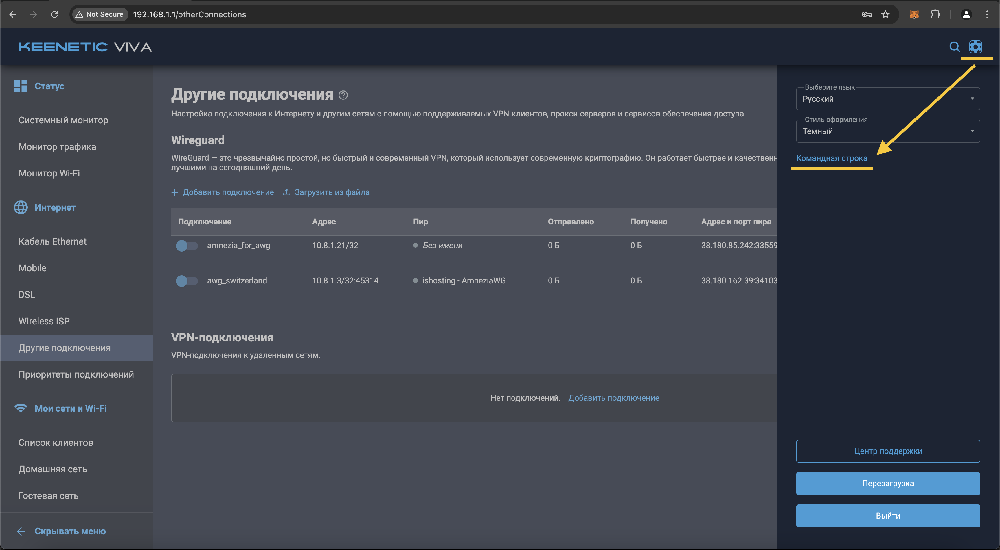
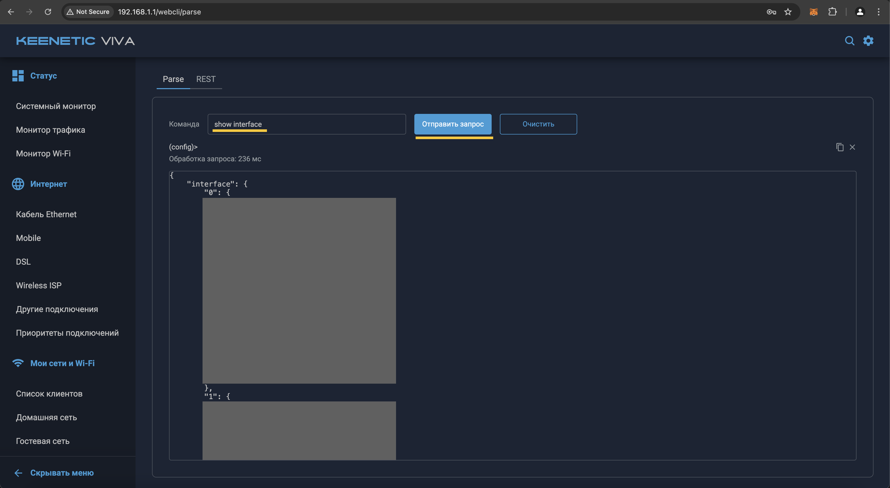
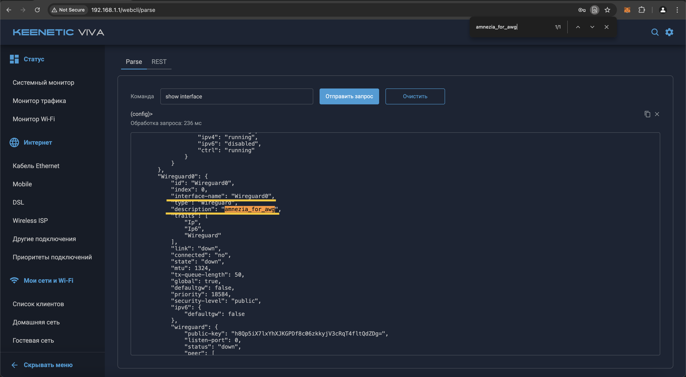
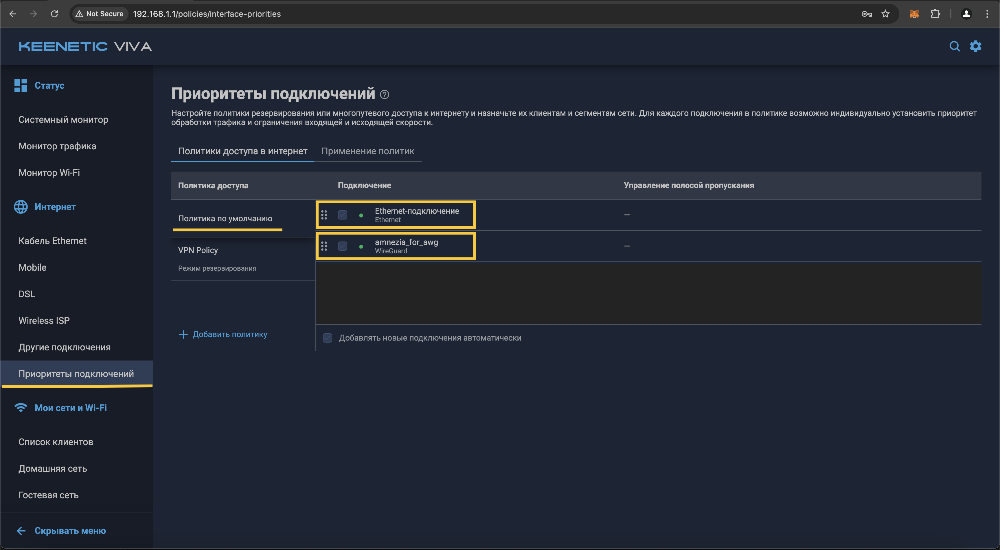

[Краткое описание]

## Этап 1: Приобретение Keenetic роутера

* Купить Keenetic роутер можно в [официальном магазине](https://shop.keenetic.ru/collection/main?characteristics%5B%5D=69931032&characteristics%5B%5D=69931147). 
* Не покупайте Mesh-ретранслятор (Keenetic Buddy) в качестве роутера. Вы не сможете настроить на нем VPN, потому что он не является роутером. 
* Если вы не знаете какая модель роутера подходит именно вам, пройдите [этот гайд](https://keenetic.ru/ru/find-my-keenetic) от Keenetic.
* Выполните базовые настройки роутера с помощью ["Мастера быстрой настройки"](https://help.keenetic.com/hc/ru/articles/360000026919-%D0%9C%D0%B0%D1%81%D1%82%D0%B5%D1%80-%D0%B1%D1%8B%D1%81%D1%82%D1%80%D0%BE%D0%B9-%D0%BD%D0%B0%D1%81%D1%82%D1%80%D0%BE%D0%B9%D0%BA%D0%B8)

Рекомендуемые характеристики роутера:

- "Flash-память, Dual Image": 128 Мбайт и выше (чтобы не возиться с установкой Entware на внешнюю память)

FAQ

    Q. На какой моделе роутера Keenetic будет работать VPN? 
    A. На любой моделе Keenetic роутера можно настроить VPN

    Q. Можно ли использовать роутер от другой компании для настройки VPN? 
    A. Технически можно настроить VPN на роутере от другой компании, если этот роутер поддерживает прошивку OpenWRT. Однако для такой настройки требуются глубокие познания в устройстве роутеров и компьютерных сетей. Мы не будем рассматривать настройку этих роутеров в данной инструкции.  

## Этап 2: Установка VPN соединения Wireguard на роутере

!!! abstract "Альтернативная инструкция "Этапа 2""

    Если у вас возникнут какие-то сложности на текущем этапе, читайте эту [инструкцию от Amnezia](https://docs.amnezia.org/ru/documentation/instructions/keenetic-os-awg/) (шаги 11-13, 27 и далее пропускайте).

Шаг 1

Откройте в веб-браузере, страницу управления роутером. Чаще всего, адрес страницы управления: http://192.168.1.1 или http://192.168.0.1 Как альтернатива, для роутеров Keenetic, можно открыть сайт: http://my.keenetic.net

    Имя пользователя по умолчанию: admin.
    Если вам не известен пароль, в некоторых случаях он может быть указан на обратной стороне роутера. Часто встречаются простые пароли по-умолчанию, например, admin или 1234.

Шаг 2

Сразу после авторизации, перейдите в раздел "Управление", далее "Параметры системы", разверните пункт "startup-config" и сохраните резервную копию нынешних настроек вашего роутера.

Шаг 3

Проверьте какая версия KeeneticOS установлена на роутере, и предлагается ли обновление KeeneticOS до версии 4.2., так как поддержка WireGuard с параметрами asc, в KeeneticOS, появилась начиная с версии 4.2 Alpha 2. Если для вашего роутера ещё не вышел релиз KeeneticOS 4.2, попробуйте переключить канал обновления, на "Предварительный". 

Если текущая версия KeeneticOS меньше 4.2, выполните обновление роутера до версии 4.2 или новее, нажав кнопу "Обновить KeeneticOS" на странице "Параметры системы". В процессе обновления, роутер выполнит перезагрузку.

Шаг 4

Если уже установлена версия KeeneticOS 4.2, нужно проверить наличие необходимого компонента системы. Нажмите кнопку "Изменить набор компонентов".

Шаг 5

На открывшейся странице "Компоненты операционной системы" проверьте наличие установленных компонентов:

- В секции "Сетевые функции"
  - "WireGuard VPN"
- В секции "Базовые компоненты"
  - "Сервер SSH"
- В секции "Пакеты OPKG"
  - "Поддержка открытых пакетов"
  - "Модули ядра для поддержки файловых систем"

Если какой-то из компонентов не установлен, отметьте соответствующий чек-бокс для установки, и нажмите появившуюся снизу кнопку "Обновить KeeneticOS". Дождитесь, пока роутер обновится и перезагрузится.

Шаг 6

После обновления и перезагрузки роутера, нужно заново авторизоваться на странице управления роутером.

Шаг 7

Убедитесь, что KeeneticOS обновилась до версии 4.2, и что необходимые компоненты, перечисленные в [Шаг 5](#Шаг 5), установлены.

Шаг 8

Теперь, вам потребуется файл конфигурации AmneziaWG в нативном формате (т.е. файл, с расширением .conf). Вы можете получить этот файл 2-мя сопсобами: 
1. Найти и оплатить аренду личного виртуального сервера VPS (цена VPS: _500-1000 руб/мес_). [Скачать AmneziaVPN](https://amnezia.org/ru/downloads). Настроить протокол AmneziaWG на виртуальном сервере через приложение AmneziaVPN. 
2. Попросить у меня выдать VPN конфиг в [личных сообщениях Telegram](https://t.me/infinity_coder) (цена: _400 руб/мес_)

    Один файл одновременно можно использовать только на одном устройстве! 

Шаг 9

Найдите и откройте только что сохранённый файл конфигурации в какой-нибудь текстовой программе, например в "_Блокноте_" (для Windows) или "_TextEdit_" (для MacOS).

Шаг 10

Из данного файла Вам понадобятся значения параметров `Jc`, `Jmin`, `Jmax`, `S1`, `S2`, `H1`, `H2`, `H3`, `H4` - это asc параметры.

Шаг 11

Теперь, Вам нужно вернуться к настройкам роутера, и перейти в раздел Интернет и выбрать "Другие подключения".

Выберите секцию Wireguard, в ней создайте новое подключения, импортировав сохранённый файл конфигурации AmneziaWG. Для этого нажмите на ссылку "Загрузить из файла"

Шаг 12

В появившемся окне файлового менеджера, перейдите в папку, где Вы сохранили файл конфигурации AmneziaWG, выберите его, и нажмите кнопку "Открыть".

Шаг 13

Через несколько секунд, в секции Wireguard, должно появится новое соединение, с таким же названием, как было у импортированного файла. Но использовать появившееся подключение, еще рано. Нужно зайти в его настройки для редактирования, щелкнув по его строке в любом месте, кроме свитчера.

    Внутренний IP-адрес созданного подключения, должен быть уникальным, среди других имеющихся соединений Wireguard. Иначе, эти соединения, будут конфликтовать. В такой ситуации, для одного из конфликтующих соединений, потребуется создать другой (новый) файл конфигурации, с другим IP-адресом.

Шаг 14

В открывшемся окне настроек подключения, отметь чек-бокс "Использовать для выхода в интернет", после чего сохраните внесённые изменения, нажав кнопку "Сохранить", внизу страницы с настройками.

    Если у Вас есть несколько соединений, с одинаковым названием, стоит переименовать их так, чтобы название только что созданного подключения WireGuard, стало уникальным.

Шаг 15

Теперь вам нужно, перейти в веб-версию командной строки роутера Keenetic, для выполнения ряда команд. Для этого необходимо перейти в настройки, нажать на изображение шестеренки, в правом верхнем углу веб-страницы, и перейти по ссылке "Командная строка".

Шаг 16

Введите команду `show interface` и нажмите кнопку "Отправить запрос". Ниже, отобразится информация обо всех имеющихся интерфейсах.

Шаг 17

Теперь нужно узнать имя нужного интерфейса, по названию созданного ранее подключения. Для этого, откройте поиск по странице (это можно сделать, одновременно нажав две клавиши, Ctrl+F). Введите для поиска, название созданного ранее подключения. В данном примере, это `amnezia_for_awg`. Должно быть найдено одно, уникальное название в поле "description". А рядом с ним, будет находится другое поле, "interface-name", в котором отображается имя нужного интерфейса. В данном примере, это `Wireguard0` .

Шаг 18

Теперь, зная имя интерфейса и значения параметров asc из файла в формате `.conf` который мы сохранили ранее. Нужно заменить все значения шаблона в скобках, вашими значениями, а сами скобки удалить.

`interface {name} wireguard asc {jc} {jmin} {jmax} {s1} {s2} {h1} {h2} {h3} {h4}`

В данном примере, строка примет вид:

`interface Wireguard0 wireguard asc 3 10 50 68 35 1909417448 2095337472 774578285 1749821106`

Получившуюся строку, нужно вставить в вэб-версии командной строки роутера, и нажать кнопку "Отправить запрос". Если Вы ввели правильную команду, ниже будет выведен результат обработки запроса, как на приведённом скриншоте.

Шаг 19

Теперь, следует сохранить изменения в конфигурации роутера. Введите команду system configuration save, и нажмите "Отправить запрос". Если всё введено верно, ниже будет выведен результат обработки запроса, как на приведённом скриншоте.

Шаг 20

Теперь нужно перейти в раздел "Интернет", далее "Другие подключения", и проверить работоспособность созданного подключения WireGuard, переключив его состояние на "Включено". Через несколько секунд, отметка активности пира, должна изменить цвет с серого, на зелёный. Также, должна отобразиться информация о входящем/исходящем трафике, и о времени с последнего "рукопожатия".

    В случае каких либо проблем с подключением, ещё раз проверьте все проделанные действия и введённые параметры. Также, можно прейти в раздел Управление -> Диагностика -> Показать журнал.

Шаг 21

Если подключение установилось успешно, нужно перейти в раздел "Интернет" - "Приоритеты подключения".

В настройках Политик доступа в Политике по умолчанию созданное VPN-подключение (amnezia_for_awg) должно идти ниже вашего основного интернет-подключения.

## Этап 3: Установка Entware

!!! abstract "Альтернативная инструкция "Этапа 3""

    Если у вас возникнут какие-то сложности на текущем этапе, читайте эту [инструкцию от Keenetic](https://help.keenetic.com/hc/ru/articles/360021888880-%D0%A3%D1%81%D1%82%D0%B0%D0%BD%D0%BE%D0%B2%D0%BA%D0%B0-OPKG-Entware-%D0%BD%D0%B0-%D0%B2%D1%81%D1%82%D1%80%D0%BE%D0%B5%D0%BD%D0%BD%D1%83%D1%8E-%D0%BF%D0%B0%D0%BC%D1%8F%D1%82%D1%8C-%D1%80%D0%BE%D1%83%D1%82%D0%B5%D1%80%D0%B0).

Шаг 1

Скачайте архив-устанощик системы пакетов репозитория [Entware](https://forum.keenetic.com/topic/4299-entware/) для вашей модели роутера Keenetic. 

Скачайте архив:

- **mipsel** — [mipsel-installer.tar.gz](files/mipsel-installer.tar.gz) для моделей: 
  - Giga (KN-1010/1011)
  - Ultra (KN-1810)
  - Viva (KN-1910/1912/1913)
  - Hero 4G (KN-2310/KN-2311)
  - Giant (KN-2610)
  - Skipper 4G (KN-2910)
  - Hopper (KN-3810)
- **mips** — [mips-installer.tar.gz](files/mips-installer.tar.gz) для моделей:
  - Giga SE (KN-2410)
  - Ultra SE (KN-2510)
  - DSL (KN-2010)
  - Launcher DSL (KN-2012)
  - Duo (KN-2110)
  - Skipper DSL (KN-2112)
  - Hopper DSL (KN-3610)
- **aarch64** — [aarch64-installer.tar.gz](files/aarch64-installer.tar.gz) для моделей: 
  - Peak (KN-2710)
  - Ultra (KN-1811)
  - Giga (KN-1012)
  - Hopper (KN-3811)
  - Hopper SE (KN-3812)

Шаг 2

Теперь нужно перейти в раздел "Управление", далее "Приложения" и нажать на "Встроенное хранилище".

Шаг 3

В открывшемся диалоговом окне нажать на иконку "Создать папку..."

Шаг 4

В поле ввода введите "install" и затем нажмите на кнопку "ОК".

Шаг 5

Выберите созданную папку "install" и затем нажмите на иконку "Загрузить файл в выбранную папку"

Шаг 6

В появившемся окне файлового менеджера, перейдите в папку, где вы сохранили установщик Entware, выберите его, и нажмите кнопку "Открыть".

Шаг 7

На этом этапе у вас должен появиться загруженный архив в хранилище роутера

Шаг 8

Теперь вам нужно, перейти в веб-версию командной строки роутера Keenetic. Для этого необходимо перейти в настройки, нажать на изображение шестеренки, в правом верхнем углу веб-страницы, и перейти по ссылке "Командная строка".

Шаг 9

В интерфейсе командной строки введите команду `opkg disk storage:/` и нажмите кнопку "Отправить запрос". Ниже будет выведен результат обработки запроса, как на приведённом скриншоте.

    После ввода команды `opkg dns-override` у вас должен пропасть интернет. Это нормально. Так и должно быть, так как мы отключаем этой командой системный DNS-сервер. Все последующие шаги по установке пакета позволят его реанимировать.

Шаг 10

Далее необходимо сохранить настройки. В том же поле введите команду `system configuration save`, и нажмите кнопку "Отправить запрос". Ниже будет выведен результат обработки запроса, как на приведённом скриншоте.

Шаг 11

Перейдите в раздел "Управление", далее "Диагностика" и нажмите на кнопку "Показать журнал".

Шаг 12

Если вы все сделали правильно, в системном журнале будет выведено сообщение "Установка системы пакетов \"Entware\" завершена". Если на этом этапе произошла ошибка, найдите решение в Google самостоятельно или [напишите мне](https://t.me/infinity_coder) в Telegram. 

## Этап 4: Установка и настройка KVAS

!!! abstract "Альтернативная инструкция "Этапа 4""

    Если у вас возникнут какие-то сложности на текущем этапе, читайте эту [инструкцию от разработчика КВАС](https://github.com/qzeleza/kvas/wiki/%D0%A3%D1%81%D1%82%D0%B0%D0%BD%D0%BE%D0%B2%D0%BA%D0%B0-%D0%BF%D0%B0%D0%BA%D0%B5%D1%82%D0%B0) или смотрите [видео на YouTube от ITDog](https://www.youtube.com/watch?v=7FKPs0_908U).

Шаг 1

Отключите поддержку IPv6 на странице вашего проводного подключения (если поддержка IPv6 доступна в интерфейсе роутера).

Для этого перейдите в раздел "Интернет", далее "Кабель Ethernet". Если в интерфейсе отображается блок "Параметры IPv6", выберите в выпадающем меню пункт "Не используется" и нажмите кнопку "Сохранить".

    Внимательный читатель мог заметить, что весь процесс установки я показывал на роутере Keenetic Viva, а отключение IPv6 на роутере Keenetic Ultra. Это как раз связано с тем, что моя модель Keenetic Viva изначально не поддерживает IPv6. 

Шаг 2

Перейдите в раздел "Мои сети и Wi-Fi", далее "Домашняя сеть". Убедитесь, что выбрана политика доступа "Политика по умолчанию". 

Шаг 3

Проверьте, что в настройках ваших клиентов, которые подключаются к нему по `wifi`, в строке адреса вашего dns, указан адрес вашего роутера, а не dns вашего провайдера или из списка стандартных адресов типа `8.8.8.8`, `1.1.1.1`, `9.9.9.9` или им подобные. 

Проверка DNS адреса для WiFi на MacOS:
1. Откройте системное меню, нажав на иконку яблока сверху слева. Нажмите "Системные настройки". 
2. Нажмите "WiFi", далее нажмите рядом с подключенной точкой доступа кнопку "Подробнее...". 
3. Проверьте, что DNS адрес написан серым текстом, то есть используется адрес роутера, а не добавлен вручную. Если это не так, выберите DNS адрес и удалите его, нажав снизу кнопку "-". На скриншоте ниже показан правильный вариант отображения DNS адреса роутера. 

Шаг 4

Проверьте, что ваш браузер не использует собственные dns, так как они имеют больший приоритет, чем настройки, указанные в пункте выше

Проверка DNS адреса для браузера Chrome:
1. Перейдите в Google Chrome и нажмите на 3 точки сверху справа. 
2. Выберите секцию "Конфиденциальность и безопасность". Нажмите на пункт "Безопасность". 
3. Проверьте, что в пункте "Выбрать поставщика услуг DNS" выбрано значение "Использовать поставщика по умолчанию". 

Шаг 5

Откройте терминал на вашем компьютере

На MacOS:
- Откройте Finder. Нажмите "Программы" -> "Утилиты" -> "Терминал". 

Шаг 6

В терминале введите команду `ssh root@192.168.1.1 -p 222`. Когда спросят "Are you sure you want to continue connecting?", введите `yes` и нажмите "Enter". Когда попросят ввести "password", введите `keenetic`. 

    Не обращайте внимание, что пароль будто не вводится в консоль. Это стандартная система безопасности, чтобы никто не подглядел пароль. После ввода пароля нажмите "Enter".

Шаг 7

Текущим шагом мы установим утилиту KVAS, которая поможет динамически определять IP адреса для заблокированных доменов и маршрутизировать запросы на эти домены через VPN. 

Выполните команду `opkg install curl && curl -sOfL http://kvas.zeleza.ru/install && sh install`

Шаг 8

Выберите настроенный ранее интерфейс Wireguard. В данном случае следовало бы напечатать `2`, так как мы настраивали в админке роутера интерфейс с названием "amnezia_for_awg". 

Шаг 9

Если попросят выбрать гостевую сеть, введите `Q`.

Шаг 10

Текущим шагом мы скачаем файл со списком всех заблокированных доменов сайтов и импортируем его в скачанную ранее утилиту KVAS. 

Введите команду `cd /tmp && curl -O https://raw.githubusercontent.com/itdoginfo/allow-domains%20/main/Russia/inside-kvas.lst && kvas import inside-kvas.lst`

!!! note

    Команда может выполняться достаточно долго. У меня команда выполнялась более 5 минут. Это нормально. Следует немного подождать. В крайнем случае вы можете закрыть терминал, разорвав SSH соединение. Заново открыть терминал, подключиться к роутеру через SSH и повторно выполнить эту команду. 

Шаг 11

Очистите локальный кэш DNS адресов на своем компьютере. Для этого закройте текущее окно терминала, разорвав SSH соединение и откройте терминал в новом окне. Выполните одну из этих команд, соответствующую вашей операционной системе. 

Если попросят ввести пароль, введите в терминале пароль от своего компьютера для входа в систему.

- **macOS**  : `sudo dscacheutil -flushcache; sudo killall -HUP mDNSResponder` 
- **Linux**  : `sudo systemd-resolve --flush-caches или sudo resolvectl flush-caches` 
- **Windows**: `ipconfig /flushdns`

Шаг 12

Проверьте, что заблокированные сайты теперь доступны без включения VPN локально на вашем компьютере. Если сайт будет недоступен, подождите 5 минут и попробуйте снова. Если сайт снова будет недоступен, перезагрузите роутер командой `system reboot` в вэб-админке роутера. 

После перезагрузки роутера у вас должен появиться доступ к большинству зарубежным сайтам.

