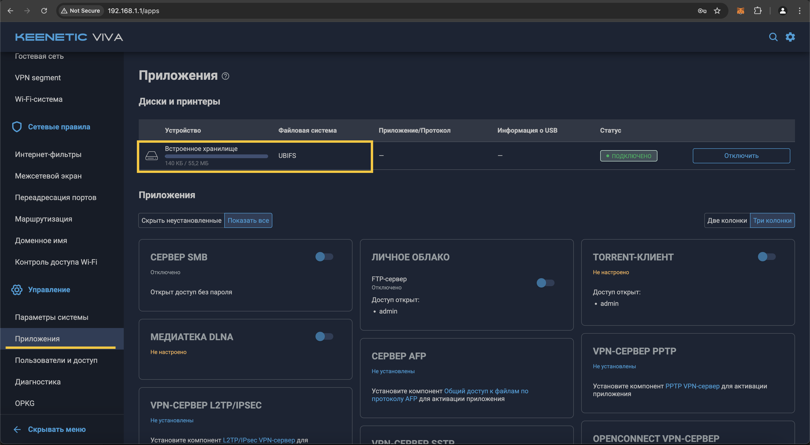

В данной инструкции вы настроите обфусцированное Wireguard подключение на роутере, установите Entware и настроите маршрутизацию по доменам в KVAS. 

**Сложность:** Сложно

**Длительность:** ~1.5 часа ⏱

**Плюсы:**

- Роутер динамически решает, какие сервисы пускать через VPN, а какие — напрямую, исключая ручное переключение VPN
- Не нужно перенастраивать маршрутизацию при смене IP адресов у сервисов
- Работают сервисы с большим количеством и динамически меняющимися IP адресами: например, Netflix на ТВ

**Минусы:**

- Сложность настройки
- Актуально только для роутеров Keenetic





## Этап 3: Установка Entware

!!! abstract "Альтернативная инструкция "Этапа 3""

    Если у вас возникнут какие-то сложности на текущем этапе, читайте эту [инструкцию от Keenetic](https://help.keenetic.com/hc/ru/articles/360021888880-%D0%A3%D1%81%D1%82%D0%B0%D0%BD%D0%BE%D0%B2%D0%BA%D0%B0-OPKG-Entware-%D0%BD%D0%B0-%D0%B2%D1%81%D1%82%D1%80%D0%BE%D0%B5%D0%BD%D0%BD%D1%83%D1%8E-%D0%BF%D0%B0%D0%BC%D1%8F%D1%82%D1%8C-%D1%80%D0%BE%D1%83%D1%82%D0%B5%D1%80%D0%B0).

Шаг 1

Перейдите в раздел "Управление", далее "Параметры системы".

Шаг 2

На открывшейся странице "Компоненты операционной системы" проверьте наличие установленных компонентов. 

В секции "Базовые компоненты":

- "Сервер SSH"

В секции "Пакеты OPKG":

- "Поддержка открытых пакетов"
- "Модули ядра для поддержки файловых систем"

Если какой-то из компонентов не установлен, отметьте соответствующий чек-бокс для установки, и нажмите появившуюся снизу кнопку "Обновить KeeneticOS". Дождитесь, пока роутер обновится и перезагрузится.

Шаг 3

Скачайте архив-устанощик системы пакетов репозитория [Entware](https://forum.keenetic.com/topic/4299-entware/) для вашей модели роутера Keenetic. 

Скачайте архив:

- **mipsel** — [mipsel-installer.tar.gz](files/mipsel-installer.tar.gz) для моделей: 
  - Giga (KN-1010/1011)
  - Ultra (KN-1810)
  - Viva (KN-1910/1912/1913)
  - Hero 4G (KN-2310/KN-2311)
  - Giant (KN-2610)
  - Skipper 4G (KN-2910)
  - Hopper (KN-3810)
- **mips** — [mips-installer.tar.gz](files/mips-installer.tar.gz) для моделей:
  - Giga SE (KN-2410)
  - Ultra SE (KN-2510)
  - DSL (KN-2010)
  - Launcher DSL (KN-2012)
  - Duo (KN-2110)
  - Skipper DSL (KN-2112)
  - Hopper DSL (KN-3610)
- **aarch64** — [aarch64-installer.tar.gz](files/aarch64-installer.tar.gz) для моделей: 
  - Peak (KN-2710)
  - Ultra (KN-1811)
  - Giga (KN-1012)
  - Hopper (KN-3811)
  - Hopper SE (KN-3812)

Шаг 4

Теперь нужно перейти в раздел "Управление", далее "Приложения" и нажать на "Встроенное хранилище".

Шаг 5

В открывшемся диалоговом окне нажать на иконку "Создать папку..."

Шаг 6

В поле ввода введите "install" и затем нажмите на кнопку "ОК".

Шаг 7

Выберите созданную папку "install" и затем нажмите на иконку "Загрузить файл в выбранную папку"

Шаг 8

В появившемся окне файлового менеджера, перейдите в папку, где вы сохранили установщик Entware, выберите его, и нажмите кнопку "Открыть".

Шаг 9

На этом этапе у вас должен появиться загруженный архив в хранилище роутера

Шаг 10

Теперь вам нужно, перейти в веб-версию командной строки роутера Keenetic. Для этого необходимо перейти в настройки, нажать на изображение шестеренки, в правом верхнем углу веб-страницы, и перейти по ссылке "Командная строка".

Шаг 11

В интерфейсе командной строки введите команду `opkg disk storage:/` и нажмите кнопку "Отправить запрос". Ниже будет выведен результат обработки запроса, как на приведённом скриншоте.

    После ввода команды `opkg dns-override` у вас должен пропасть интернет. Это нормально. Так и должно быть, так как мы отключаем этой командой системный DNS-сервер. Все последующие шаги по установке пакета позволят его реанимировать.

Шаг 12

Далее необходимо сохранить настройки. В том же поле введите команду `system configuration save`, и нажмите кнопку "Отправить запрос". Ниже будет выведен результат обработки запроса, как на приведённом скриншоте.

Шаг 13

Перейдите в раздел "Управление", далее "Диагностика" и нажмите на кнопку "Показать журнал".

Шаг 14

Если вы все сделали правильно, в системном журнале будет выведено сообщение "Установка системы пакетов \"Entware\" завершена". Если на этом этапе произошла ошибка, найдите решение в Google самостоятельно или [напишите мне](https://t.me/infinity_coder) в Telegram. 

## Этап 4: Установка и настройка KVAS

!!! abstract "Альтернативная инструкция "Этапа 4""

    Если у вас возникнут какие-то сложности на текущем этапе, читайте эту [инструкцию от разработчика КВАС](https://github.com/qzeleza/kvas/wiki/%D0%A3%D1%81%D1%82%D0%B0%D0%BD%D0%BE%D0%B2%D0%BA%D0%B0-%D0%BF%D0%B0%D0%BA%D0%B5%D1%82%D0%B0) или смотрите [видео на YouTube от ITDog](https://www.youtube.com/watch?v=7FKPs0_908U).

Шаг 1

Отключите поддержку IPv6 на странице вашего проводного подключения (если поддержка IPv6 доступна в интерфейсе роутера).

Для этого перейдите в раздел "Интернет", далее "Кабель Ethernet". Если в интерфейсе отображается блок "Параметры IPv6", выберите в выпадающем меню пункт "Не используется" и нажмите кнопку "Сохранить".

    Внимательный читатель мог заметить, что весь процесс установки я показывал на роутере Keenetic Viva, а отключение IPv6 на роутере Keenetic Ultra. Это как раз связано с тем, что моя модель Keenetic Viva изначально не поддерживает IPv6. 

Шаг 2

Перейдите в раздел "Мои сети и Wi-Fi", далее "Домашняя сеть". Убедитесь, что выбрана политика доступа "Политика по умолчанию". 

Шаг 3

Проверьте, что в настройках ваших клиентов, которые подключаются к нему по `wifi`, в строке адреса вашего dns, указан адрес вашего роутера, а не dns вашего провайдера или из списка стандартных адресов типа `8.8.8.8`, `1.1.1.1`, `9.9.9.9` или им подобные. 

Проверка DNS адреса для WiFi на MacOS:
1. Откройте системное меню, нажав на иконку яблока сверху слева. Нажмите "Системные настройки". 
2. Нажмите "WiFi", далее нажмите рядом с подключенной точкой доступа кнопку "Подробнее...". 
3. Проверьте, что DNS адрес написан серым текстом, то есть используется адрес роутера, а не добавлен вручную. Если это не так, выберите DNS адрес и удалите его, нажав снизу кнопку "-". На скриншоте ниже показан правильный вариант отображения DNS адреса роутера. 

Шаг 4

Проверьте, что ваш браузер не использует собственные dns, так как они имеют больший приоритет, чем настройки, указанные в пункте выше

Проверка DNS адреса для браузера Chrome:
1. Перейдите в Google Chrome и нажмите на 3 точки сверху справа. 
2. Выберите секцию "Конфиденциальность и безопасность". Нажмите на пункт "Безопасность". 
3. Проверьте, что в пункте "Выбрать поставщика услуг DNS" выбрано значение "Использовать поставщика по умолчанию". 

Шаг 5

Откройте терминал на вашем компьютере

На MacOS:
- Откройте Finder. Нажмите "Программы" -> "Утилиты" -> "Терминал". 

Шаг 6

В терминале введите команду `ssh root@192.168.1.1 -p 222`. Когда спросят "Are you sure you want to continue connecting?", введите `yes` и нажмите "Enter". Когда попросят ввести "password", введите `keenetic`. 

    Не обращайте внимание, что пароль будто не вводится в консоль. Это стандартная система безопасности, чтобы никто не подглядел пароль. После ввода пароля нажмите "Enter".

Шаг 7

Текущим шагом мы установим утилиту KVAS, которая поможет динамически определять IP адреса для заблокированных доменов и маршрутизировать запросы на эти домены через VPN. 

Выполните команду `opkg install curl && curl -sOfL http://kvas.zeleza.ru/install && sh install`

Шаг 8

Выберите настроенный ранее интерфейс Wireguard. В данном случае следовало бы напечатать `2`, так как мы настраивали в админке роутера интерфейс с названием "amnezia_for_awg". 

Шаг 9

Если попросят выбрать гостевую сеть, введите `Q`.

Шаг 10

Текущим шагом мы скачаем файл со списком всех заблокированных доменов сайтов и импортируем его в скачанную ранее утилиту KVAS. 

Введите команду `cd /tmp && curl -O https://raw.githubusercontent.com/itdoginfo/allow-domains%20/main/Russia/inside-kvas.lst && kvas import inside-kvas.lst`

!!! note

    Команда может выполняться достаточно долго. У меня команда выполнялась более 5 минут. Это нормально. Следует немного подождать. В крайнем случае вы можете закрыть терминал, разорвав SSH соединение. Заново открыть терминал, подключиться к роутеру через SSH и повторно выполнить эту команду. 

Шаг 11

Очистите локальный кэш DNS адресов на своем компьютере. Для этого закройте текущее окно терминала, разорвав SSH соединение и откройте терминал в новом окне. Выполните одну из этих команд, соответствующую вашей операционной системе. 

Если попросят ввести пароль, введите в терминале пароль от своего компьютера для входа в систему.

- **macOS**  : `sudo dscacheutil -flushcache; sudo killall -HUP mDNSResponder` 
- **Linux**  : `sudo systemd-resolve --flush-caches или sudo resolvectl flush-caches` 
- **Windows**: `ipconfig /flushdns`

Шаг 12

Проверьте, что заблокированные сайты теперь доступны без включения VPN локально на вашем компьютере. Если сайт будет недоступен, подождите 5 минут и попробуйте снова. Если сайт снова будет недоступен, перезагрузите роутер командой `system reboot` в вэб-админке роутера. 

После перезагрузки роутера у вас должен появиться доступ к большинству зарубежным сайтам.

