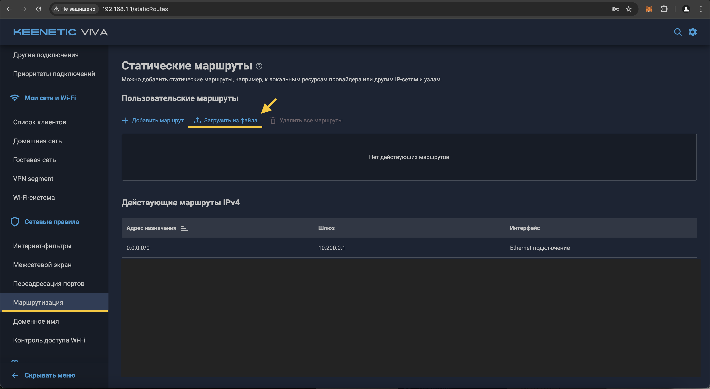
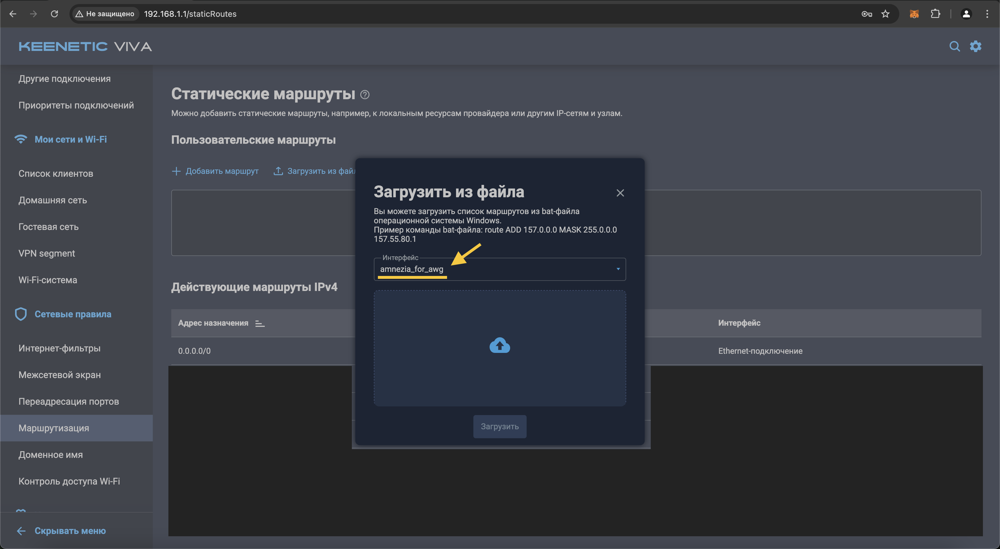
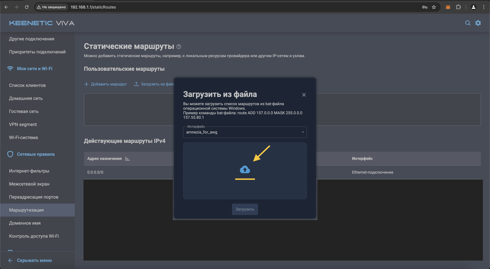
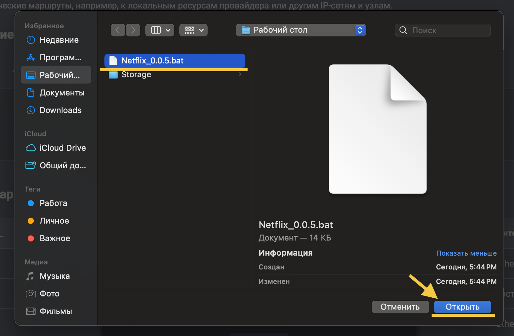

В данной инструкции вы настроите обфусцированное Wireguard подключение на роутере, и настроите VPN маршрутизацию на IP адреса заблокированных сервисов. 

**Сложность:** Средняя

**Длительность:** ~1 час ⏱

**Плюсы:**

- Роутер динамически решает, какие сервисы пускать через VPN, а какие — напрямую, исключая ручное переключение VPN
- Относительная простота настройки

**Минусы:**

- Нужно перенастраивать маршрутизацию при смене IP адресов у сервисов (примерно раз в полгода)
- Не работают сервисы с большим количеством и динамически меняющимися IP адресами: например, Netflix на ТВ
- Актуально только для роутеров Keenetic





## Этап 3: Загрузка маршрутов

!!! abstract "Альтернативная инструкция "Этапа 3""

    Если у вас возникнут какие-то сложности на текущем этапе, читайте эту [инструкцию от Blackrock](https://rockblack.su/vpn/dopolnitelno/diapazon-ip-adresov).

Шаг 1

Скачайте файлы с маршрутами для тех сервисов, которыми пользуетесь. 

Маршруты: 

- [ChatGPT(OpenAI)_0.0.5.bat](../files/ip_subnets/ChatGPT(OpenAI)_0.0.5.bat) - обновлено 09.09.2024
- [Discord_0.0.1.bat](../files/ip_subnets/Discord_0.0.1.bat) - обновлено 08.10.2024
- [Facebook_0.0.2.bat](../files/ip_subnets/Facebook_0.0.2.bat) - обновлено 19.08.2024
- [Instagram_0.0.6.bat](../files/ip_subnets/Instagram_0.0.6.bat) - обновлено 24.08.2024
- [Netflix_0.0.5.bat](../files/ip_subnets/Netflix_0.0.5.bat) - обновлено 09.09.2024
- [Notion_0.0.1.bat](../files/ip_subnets/Notion_0.0.1.bat) - обновлено 09.09.2024
- [TikTok_0.0.3.bat](../files/ip_subnets/TikTok_0.0.3.bat) - обновлено 19.08.2024
- [Twitter_0.0.6.bat](../files/ip_subnets/Twitter_0.0.6.bat) - обновлено 21.09.2024
- [YouTube_0.2.bat](../files/ip_subnets/YouTube_0.2.bat) - обновлено 14.10.2024

Шаг 2

Перейдите в раздел "Сетевые правила", далее "Маршрутизация". Нажмите на кнопку "Загрузить из файла".

Шаг 3

Выберите в выпадающем меню настроенный ранее интерфейс Wireguard. 

Шаг 4

Нажмите на кнопку загрузки файла, которая находится под выпадающим списком.

Шаг 5

Выберите один из скачанных файлов с маршрутами сервиса, который хотите разблокировать и нажмите кнопку "Открыть". Если вы скачали несколько файлов с маршрутами, повторите [Шаг 4](#step_3_4) и [Шаг 5](#step_3_5) для каждого файла. 

