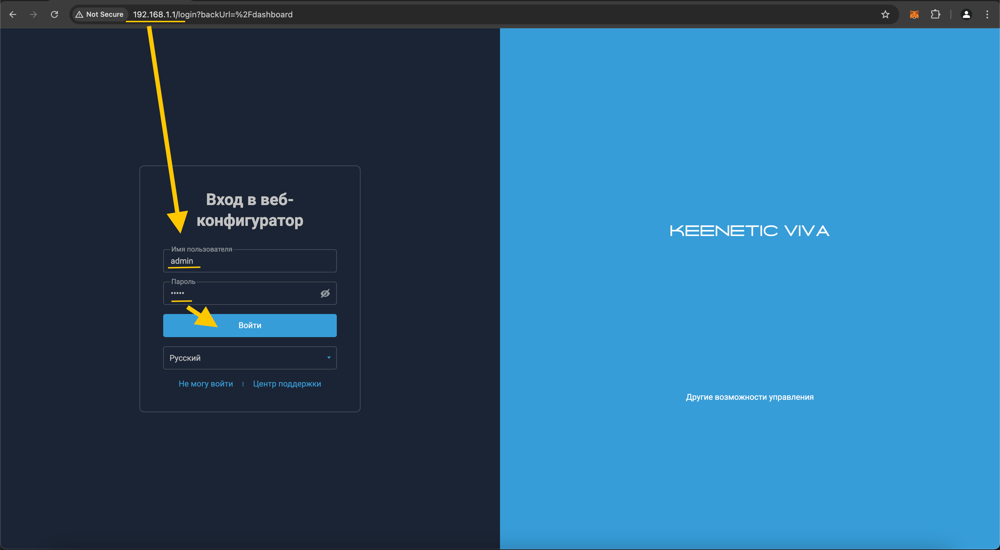
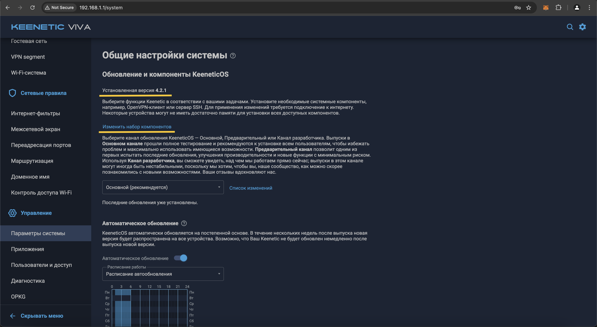
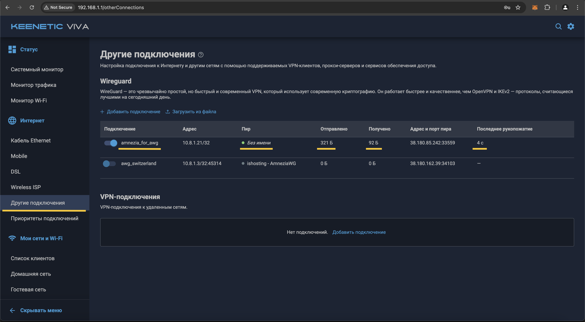

## Этап 2: Установка VPN соединения Wireguard на роутере

!!! abstract "Альтернативная инструкция "Этапа 2""

    Если у вас возникнут какие-то сложности на текущем этапе, читайте эту [инструкцию от Amnezia](https://docs.amnezia.org/ru/documentation/instructions/keenetic-os-awg/) (шаги 11-13, 27 и далее пропускайте).

Шаг 1

Откройте в веб-браузере, страницу управления роутером. Чаще всего, адрес страницы управления: http://192.168.1.1 или http://192.168.0.1 Как альтернатива, для роутеров Keenetic, можно открыть сайт: http://my.keenetic.net

    Имя пользователя по умолчанию: admin.
    Если вам не известен пароль, в некоторых случаях он может быть указан на обратной стороне роутера. Часто встречаются простые пароли по-умолчанию, например, admin или 1234.

Шаг 2

Сразу после авторизации, перейдите в раздел "Управление", далее "Параметры системы", разверните пункт "startup-config" и сохраните резервную копию нынешних настроек вашего роутера.

Шаг 3

Проверьте какая версия KeeneticOS установлена на роутере, и предлагается ли обновление KeeneticOS до версии 4.2., так как поддержка WireGuard с параметрами asc, в KeeneticOS, появилась начиная с версии 4.2 Alpha 2. Если для вашего роутера ещё не вышел релиз KeeneticOS 4.2, попробуйте переключить канал обновления, на "Предварительный". 

Если текущая версия KeeneticOS меньше 4.2, выполните обновление роутера до версии 4.2 или новее, нажав кнопу "Обновить KeeneticOS" на странице "Параметры системы". В процессе обновления, роутер выполнит перезагрузку.

Шаг 4

Если уже установлена версия KeeneticOS 4.2, нужно проверить наличие необходимого компонента системы. Нажмите кнопку "Изменить набор компонентов".

Шаг 5

На открывшейся странице "Компоненты операционной системы" проверьте наличие установленных компонентов. 

В секции "Сетевые функции":

- "WireGuard VPN"

Если компонент не установлен, отметьте соответствующий чек-бокс для установки, и нажмите появившуюся снизу кнопку "Обновить KeeneticOS". Дождитесь, пока роутер обновится и перезагрузится.

Шаг 6

После обновления и перезагрузки роутера, нужно заново авторизоваться на странице управления роутером.

Шаг 7

Убедитесь, что KeeneticOS обновилась до версии 4.2, и что необходимые компоненты, перечисленные выше, установлены.

Шаг 8

Теперь, вам потребуется файл конфигурации AmneziaWG в нативном формате (т.е. файл, с расширением .conf). Вы можете получить этот файл 2-мя сопсобами: 
1. Найти и оплатить аренду личного виртуального сервера VPS (цена VPS: _500-1000 руб/мес_). [Скачать AmneziaVPN](https://amnezia.org/ru/downloads). Настроить протокол AmneziaWG на виртуальном сервере через приложение AmneziaVPN. 
2. Попросить у меня выдать VPN конфиг в [личных сообщениях Telegram](https://t.me/infinity_coder) (цена: _400 руб/мес_)

    Один файл одновременно можно использовать только на одном устройстве! 

Шаг 9

Найдите и откройте только что сохранённый файл конфигурации в какой-нибудь текстовой программе, например в "_Блокноте_" (для Windows) или "_TextEdit_" (для MacOS).

Шаг 10

Из данного файла Вам понадобятся значения параметров `Jc`, `Jmin`, `Jmax`, `S1`, `S2`, `H1`, `H2`, `H3`, `H4` - это asc параметры.

Шаг 11

Теперь, Вам нужно вернуться к настройкам роутера, и перейти в раздел Интернет и выбрать "Другие подключения".

Выберите секцию Wireguard, в ней создайте новое подключения, импортировав сохранённый файл конфигурации AmneziaWG. Для этого нажмите на ссылку "Загрузить из файла"

Шаг 12

В появившемся окне файлового менеджера, перейдите в папку, где Вы сохранили файл конфигурации AmneziaWG, выберите его, и нажмите кнопку "Открыть".

Шаг 13

Через несколько секунд, в секции Wireguard, должно появится новое соединение, с таким же названием, как было у импортированного файла. Но использовать появившееся подключение, еще рано. Нужно зайти в его настройки для редактирования, щелкнув по его строке в любом месте, кроме свитчера.

    Внутренний IP-адрес созданного подключения, должен быть уникальным, среди других имеющихся соединений Wireguard. Иначе, эти соединения, будут конфликтовать. В такой ситуации, для одного из конфликтующих соединений, потребуется создать другой (новый) файл конфигурации, с другим IP-адресом.

Шаг 14

В открывшемся окне настроек подключения, отметь чек-бокс "Использовать для выхода в интернет", после чего сохраните внесённые изменения, нажав кнопку "Сохранить", внизу страницы с настройками.

    Если у Вас есть несколько соединений, с одинаковым названием, стоит переименовать их так, чтобы название только что созданного подключения WireGuard, стало уникальным.

Шаг 15

Теперь вам нужно, перейти в веб-версию командной строки роутера Keenetic, для выполнения ряда команд. Для этого необходимо перейти в настройки, нажать на изображение шестеренки, в правом верхнем углу веб-страницы, и перейти по ссылке "Командная строка".

Шаг 16

Введите команду `show interface` и нажмите кнопку "Отправить запрос". Ниже, отобразится информация обо всех имеющихся интерфейсах.

Шаг 17

Теперь нужно узнать имя нужного интерфейса, по названию созданного ранее подключения. Для этого, откройте поиск по странице (это можно сделать, одновременно нажав две клавиши, Ctrl+F). Введите для поиска, название созданного ранее подключения. В данном примере, это `amnezia_for_awg`. Должно быть найдено одно, уникальное название в поле "description". А рядом с ним, будет находится другое поле, "interface-name", в котором отображается имя нужного интерфейса. В данном примере, это `Wireguard0` .

Шаг 18

Теперь, зная имя интерфейса и значения параметров asc из файла в формате `.conf` который мы сохранили ранее. Нужно заменить все значения шаблона в скобках, вашими значениями, а сами скобки удалить.

`interface {name} wireguard asc {jc} {jmin} {jmax} {s1} {s2} {h1} {h2} {h3} {h4}`

В данном примере, строка примет вид:

`interface Wireguard0 wireguard asc 3 10 50 68 35 1909417448 2095337472 774578285 1749821106`

Получившуюся строку, нужно вставить в вэб-версии командной строки роутера, и нажать кнопку "Отправить запрос". Если Вы ввели правильную команду, ниже будет выведен результат обработки запроса, как на приведённом скриншоте.

Шаг 19

Теперь, следует сохранить изменения в конфигурации роутера. Введите команду system configuration save, и нажмите "Отправить запрос". Если всё введено верно, ниже будет выведен результат обработки запроса, как на приведённом скриншоте.

Шаг 20

Теперь нужно перейти в раздел "Интернет", далее "Другие подключения", и проверить работоспособность созданного подключения WireGuard, переключив его состояние на "Включено". Через несколько секунд, отметка активности пира, должна изменить цвет с серого, на зелёный. Также, должна отобразиться информация о входящем/исходящем трафике, и о времени с последнего "рукопожатия".

    В случае каких либо проблем с подключением, ещё раз проверьте все проделанные действия и введённые параметры. Также, можно прейти в раздел Управление -> Диагностика -> Показать журнал.

Шаг 21

Если подключение установилось успешно, нужно перейти в раздел "Интернет" - "Приоритеты подключения".

В настройках Политик доступа в Политике по умолчанию созданное VPN-подключение (amnezia_for_awg) должно идти ниже вашего основного интернет-подключения.

